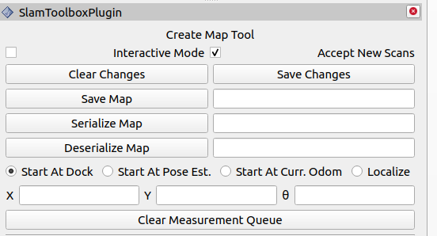
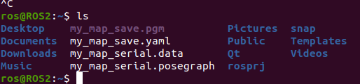
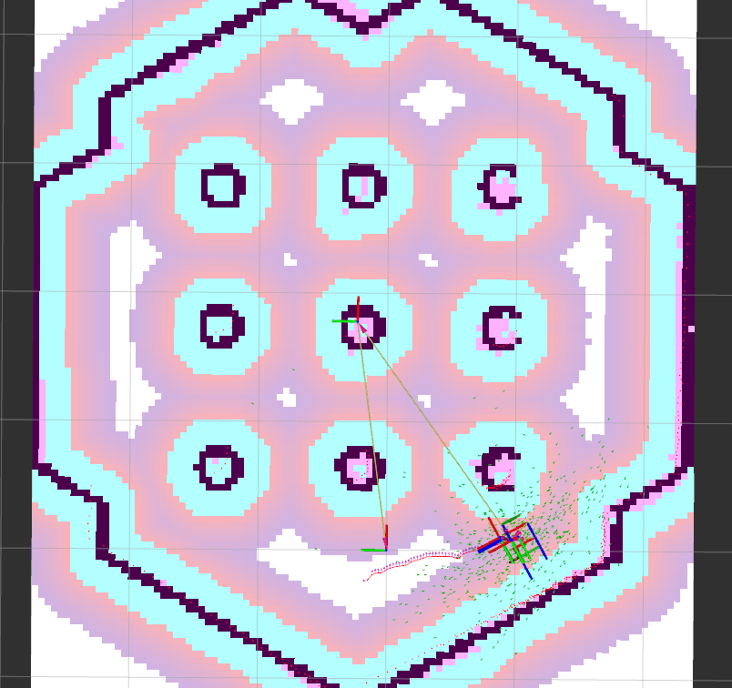
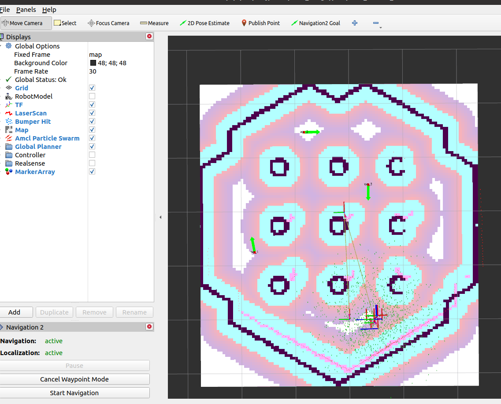
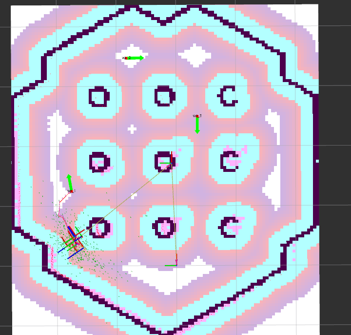

# ROS2 Navigation2

> 如果是其他系统需要将`foxy`替换为对应的版本

## 1. Generate a Map with slam_toolbox

### 环境安装

1. 安装 Cyclone DDS 
    ```shell
    $ sudo apt install ros-foxy-rmw-cyclonedds-cpp
    ```

2. 设置RWM_IMPLEMENTATION的参数
   ```shell
   $ echo "export RWM_IMPLEMENTATION=rwm_cyclonedds_cpp" >> ~/.bashrc
   ```

3. 安装navigation2
   ```shell
   $ sudo apt install ros-foxy-navigation2 ros-foxy-nav2-bringup ros-foxy-turtlebot3*
   ```

4. 安装 slam-toolbox
   ```shell
   $ sudo apt install ros-foxy-slam-toolbox
   ```

5. 设置turtlebot3的机器人模型
   ```shell
   $ echo "export TURTLEBOT3_MODEL=waffle" >> ~/.bashrc
   ```

### 启动节点

1. 启动Gazebo仿真环境

   ```shell
   $ ros2 launch turtlebot3_gazebo turtlebot3_world.launch.py
   ```

2. 启动导航系统，系统在仿真时间模式下运行

   ```shell
   $ ros2 launch nav2_bringup navigation_launch.py use_sim_time:=True
   ```

3. 启动slam工具箱的在线模式

   ```shell
   $ ros2 launch slam_toolbox online_async_launch.py use_sim_time:=True
   ```


9. 启动rviz，指定rviz配置文件

   ```shell
   $ ros2 run rviz2 rviz2 -d /opt/ros/foxy/share/nav2_bringup/rviz/nav2_default_view.rviz 
   ```

10. 启动键盘控制

    ```shell
    $ ros2 run turtlebot3_teleop teleop_keyboard
    ```

### 保存地图
方式一：使用命令行，my_map为保存地图的名字

```shell
$ ros2 run nav2_map_server map_saver_cli -f my_map
```
如果保存失败 Timeout，可增加超时时间，如下：20000为超时时间，代码默认是2000
```shell
$ ros2 run nav2_map_server map_saver_cli -f my_map --ros-args -p save_map_timeout:=20000
```
执行完之后会在当前路径生成两个文件

方式二：
在rviz界面，选择 Panels->Add new panel，选择 SlamToolBoxPlugin，填写Save Map和 Serialize Map，再点击对应按钮即可。

在home下会生成四个文件


### 结果

地图文件

Gazebo文件


## Navigate in an existing map
> 在已知地图中导航

### 环境安装

1. 安装 Cyclone DDS 
    ```shell
    $ sudo apt install ros-foxy-rmw-cyclonedds-cpp
    ```

2. 设置RWM_IMPLEMENTATION的参数
   ```shell
   $ echo "export RWM_IMPLEMENTATION=rwm_cyclonedds_cpp" >> ~/.bashrc
   ```

3. 安装navigation2
   ```shell
   $ sudo apt install ros-foxy-navigation2 ros-foxy-nav2-bringup ros-foxy-turtlebot3*
   ```

4. 设置turtlebot3的机器人模型
   ```shell
   $ echo "export TURTLEBOT3_MODEL=waffle" >> ~/.bashrc
   ```

### 开始
1. 修改
   ```shell
   $ cd /opt/ros/foxy/share/turtlebot3_navigation2/param
   $ sudo gedit waffle.yaml
   $ reboot
   ```
2. 重启之后打开gazebo仿真环境
   ```shell
   $ ros2 launch turtlebot3_gazebo turtlebot3_world.launch.py
   ```
3. 打开导航系统,指定地图文件, map/my_map.yaml为地图配置文件
   ```shell
   ros2 launch turtlebot3_navigation2 navigation2.launch.py use_sim_time:=True map:=map/my_map.yaml 
   ```
4. 启动之后，会出现Global Status:Error，这个时候需要对机器人进行重定位，打开Gazebo，观察机器人在地图中的位置和方向，在rviz界面点击2D Pose Estimate，在地图中点击鼠标左键确定机器人位置，长按左键进行拖动确定机器人方向
5. 开始导航，点击Navigation2 Goal，再在地图中通过鼠标左键点击一个位置并拖动确定方向，会自动生成导航路线，机器人开始运动,在gazebo中同步进行。
   
6. 多点导航
   点击 Waypoint mode, 点击 Navigation2 Goal, 通过鼠标左键在地图中选第一个点，再次点击 Navigation2 Goal选择第二个点，以此类推
   
   最后点击Start Navigation，机器人就会沿着目标点进行运动
   